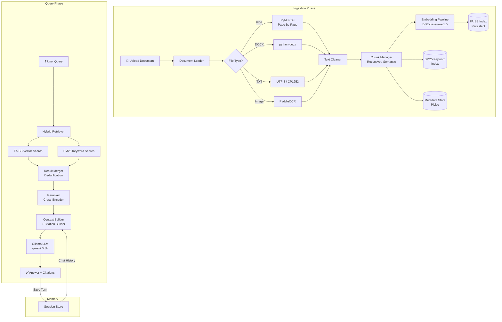

# 🧠 Advanced RAG Pipeline

> A production-ready Retrieval-Augmented Generation system with Hybrid Search, Cross-Encoder Reranking, Multi-Format Document Parsing, and Conversational Memory — built with FastAPI, FAISS, and Ollama.

[](https://www.python.org/)
[](https://fastapi.tiangolo.com/)
[](https://github.com/facebookresearch/faiss)
[](LICENSE)

---

## 📋 Table of Contents

- [Overview](#-overview)
- [Architecture](#-architecture)
- [Features](#-features)
- [Tech Stack](#-tech-stack)
- [Project Structure](#-project-structure)
- [Setup & Installation](#-setup--installation)
- [API Reference](#-api-reference)
- [Pipeline Workflow](#-pipeline-workflow)
- [Retrieval Evaluation](#-retrieval-evaluation)
- [Design Decisions](#-design-decisions)
- [Future Improvements](#-future-improvements)
- [Deliverables Checklist](#-deliverables-checklist)

---

## 🔍 Overview

This project implements a complete **Retrieval-Augmented Generation (RAG)** pipeline that allows users to upload documents (PDF, DOCX, TXT, Images), ask natural language questions, and receive accurate, hallucination-free answers grounded in the uploaded content — complete with **page-level citations**.

Unlike basic RAG implementations that rely solely on vector similarity, this system uses a **three-stage retrieval strategy**:

1. **Hybrid Search** — Combines dense vector search (FAISS) with sparse keyword search (BM25) to capture both semantic meaning and exact terminology.
2. **Cross-Encoder Reranking** — A dedicated neural model re-scores the combined results to push the most contextually relevant chunks to the top.
3. **Grounded Generation** — Retrieved context is formatted with source metadata and passed to a local LLM (Ollama) with strict anti-hallucination instructions.

---

## 🏗️ Architecture



---

## ✨ Features

### Core Features
- ✅ **Multi-Format Ingestion** — PDF (page-by-page), DOCX, TXT, and Images (OCR)
- ✅ **Hybrid Search** — FAISS Inner Product + BM25 Okapi with deduplication
- ✅ **Cross-Encoder Reranking** — BAAI/bge-reranker-base re-scores candidates
- ✅ **Persistent Vector Store** — FAISS index + metadata saved to disk automatically
- ✅ **Page-Level Citations** — Every answer includes document name and exact page number
- ✅ **Anti-Hallucination Guard** — Strict prompt engineering + response validation
- ✅ **Conversational Memory** — Session-based chat history with automatic trimming

### Production Features
- ✅ **Centralized Logging** — Timestamped, structured logs for all pipeline stages
- ✅ **Input Validation** — File type, file size, and query length enforcement
- ✅ **Graceful Error Handling** — HTTP status codes (400, 413, 422, 500) with safe fallbacks
- ✅ **Automated Evaluation** — Hit@1, Hit@3, Hit@5 metrics with Markdown report generation

---

## 🛠️ Tech Stack

| Component | Technology | Purpose |
|---|---|---|
| **API Framework** | FastAPI | REST endpoints for upload and query |
| **Vector Database** | FAISS (IndexFlatIP) | Dense vector storage and similarity search |
| **Keyword Search** | rank_bm25 (BM25Okapi) | Sparse keyword-based retrieval |
| **Embedding Model** | BAAI/bge-base-en-v1.5 | 768-dimensional text embeddings |
| **Reranker** | BAAI/bge-reranker-base | Cross-Encoder relevance scoring |
| **LLM** | Ollama (qwen2.5:3b) | Local answer generation |
| **PDF Parsing** | PyMuPDF (fitz) | Page-by-page text extraction |
| **DOCX Parsing** | python-docx | Paragraph extraction |
| **Image OCR** | PaddleOCR | Text extraction from images |
| **Chunking** | LangChain RecursiveCharacterTextSplitter | Configurable text splitting |
| **Serialization** | Pickle + FAISS I/O | Persistent index and metadata storage |

---

## 📁 Project Structure

```
Task-5-RAG-Pipeline/
│
├── src/
│   ├── api/
│   │   └── routes.py                 # FastAPI endpoints (/upload, /query)
│   │
│   ├── loaders/
│   │   ├── document_loader.py        # Central router for all file types
│   │   ├── pdf_loader.py             # PyMuPDF page-by-page extraction
│   │   ├── docx_loader.py            # python-docx paragraph extraction
│   │   ├── txt_loader.py             # UTF-8/CP1252 text reading
│   │   └── image_loader.py           # PaddleOCR text extraction
│   │
│   ├── processing/
│   │   ├── cleaner.py                # Text normalization and cleaning
│   │   ├── chunk_manager.py          # Strategy router (recursive/semantic)
│   │   ├── recursive_chunker.py      # LangChain recursive splitting
│   │   └── semantic_chunker.py       # Embedding-based sentence grouping
│   │
│   ├── embeddings/
│   │   └── embedding_pipeline.py     # BGE embedding generation + normalization
│   │
│   ├── vectorstore/
│   │   └── faiss_manager.py          # FAISS index with disk persistence
│   │
│   ├── retrieval/
│   │   ├── bm25_retriever.py         # BM25 keyword search
│   │   ├── vector_retriever.py       # FAISS vector search
│   │   ├── hybrid_retriever.py       # BM25 + Vector merger with deduplication
│   │   ├── reranker.py               # Cross-Encoder re-scoring
│   │   └── retrieval_pipeline.py     # Full retrieval orchestration
│   │
│   ├── generation/
│   │   ├── generation_pipeline.py    # LLM generation orchestration
│   │   ├── context_builder.py        # Formats retrieved chunks for LLM
│   │   ├── prompt_builder.py         # RAG prompt template engine
│   │   ├── prompt_templates.py       # Strict anti-hallucination template
│   │   ├── citation_builder.py       # Deduplicated source citations
│   │   └── response_validator.py     # Output quality validation
│   │
│   ├── llm/
│   │   └── ollama_client.py          # Ollama API client with error handling
│   │
│   ├── metadata/
│   │   └── metadata.py               # Rich chunk metadata extraction
│   │
│   ├── evaluation/
│   │   └── evaluate_retrieval.py     # Automated Hit@K evaluation script
│   │
│   └── utils/
│       └── logger.py                 # Centralized logging configuration
│
├── storage/                          # Auto-created at runtime
│   ├── faiss.index                   # Persisted FAISS vector index
│   └── metadata.pkl                  # Persisted chunk metadata
│
├── test_set.json                     # 25-question ground truth test set
├── retrieval_report.md               # Auto-generated evaluation report
├── requirements.txt
└── README.md
```

---

## ⚙️ Setup & Installation

### Prerequisites
- Python 3.10+
- [Ollama](https://ollama.com/) installed and running
- 4GB+ RAM (8GB+ recommended)
- NVIDIA GPU recommended (optional — CPU fallback supported)

### Step 1: Clone and Install Dependencies

```bash
git clone <your-repo-url>
cd Task-5-RAG-Pipeline

# Create virtual environment
python -m venv .venv
source .venv/bin/activate        # Mac/Linux
.venv\Scripts\activate           # Windows

# Install Python dependencies
pip install -r requirements.txt
```

### Step 2: Install and Pull LLM Model

```bash
# Install Ollama from https://ollama.com/
ollama pull qwen2.5:3b
```

### Step 3: Start the API Server

```bash
uvicorn src.api.routes:router --host 0.0.0.0 --port 8000 --reload
```

The API will be available at `http://localhost:8000`.

Interactive docs: `http://localhost:8000/docs`

---

## 📡 API Reference

### `POST /upload`
Upload a document for indexing. Supported formats: `.pdf`, `.docx`, `.txt`, `.png`, `.jpg`, `.jpeg`

**Request:**
```bash
curl -X POST http://localhost:8000/upload \
  -F "file=@Business-Policies.pdf"
```

**Response:**
```json
{
  "status": "success",
  "chunks_indexed": 28,
  "total_vectors_in_db": 28
}
```

**Error Responses:**
| Status Code | Condition |
|---|---|
| `400` | Unsupported file type |
| `413` | File exceeds 20MB limit |
| `422` | No readable text extracted |
| `500` | Internal processing error |

---

### `GET /query`
Ask a question about uploaded documents.

**Parameters:**
| Parameter | Type | Required | Default | Description |
|---|---|---|---|---|
| `q` | string | ✅ Yes | — | The question (min 3 characters) |
| `session_id` | string | ❌ No | `"default"` | Conversation session identifier |

**Request:**
```bash
curl "http://localhost:8000/query?q=what+is+business+policy&session_id=user_1"
```

**Response:**
```json
{
  "query": "what is business policy",
  "answer": "Business policy is the study of roles and responsibilities of top-level management...",
  "citations": [
    { "document": "Business-Policies.pdf", "page": 1 },
    { "document": "Business-Policies.pdf", "page": 2 }
  ],
  "sources": [ ... ],
  "session_id": "user_1"
}
```

---

## 🔄 Pipeline Workflow

### Ingestion Flow
```
Upload File
    │
    ▼
Document Loader (routes by extension)
    │
    ├─ PDF  → PyMuPDF (page-by-page extraction)
    ├─ DOCX → python-docx (paragraph extraction)
    ├─ TXT  → UTF-8 read (CP1252 fallback)
    └─ IMG  → PaddleOCR (text recognition)
    │
    ▼
Text Cleaner (normalize whitespace, special chars)
    │
    ▼
Chunk Manager (Recursive: 500 chars, 100 overlap)
    │
    ▼
Metadata Extractor (chunk_id, document_name, page_number, source_type)
    │
    ▼
Embedding Pipeline (BGE-base-en-v1.5, L2-normalized, 768-dim)
    │
    ▼
FAISS Manager (add to IndexFlatIP + save to disk)
```

### Query Flow
```
User Question
    │
    ▼
Hybrid Retriever
    ├─ FAISS Vector Search (semantic similarity, top-10)
    └─ BM25 Keyword Search (exact term matching, top-10)
    │
    ▼
Result Merger (union + deduplication by chunk_text)
    │
    ▼
Cross-Encoder Reranker (BGE-reranker-base, re-scores top-10)
    │
    ▼
Top-5 Results (with full metadata)
    │
    ▼
Context Builder (format with source headers)
    + Citation Builder (deduplicate by document + page)
    │
    ▼
Prompt Builder (strict RAG template + chat history)
    │
    ▼
Ollama LLM (qwen2.5:3b, 4096 context window)
    │
    ▼
Response Validator → Final Answer + Citations
```

---

## 📊 Retrieval Evaluation

### How to Run
1. Ensure documents are uploaded and the FAISS index is populated.
2. Place `test_set.json` in the project root (25 ground-truth Q&A pairs).
3. Run the evaluation:

```bash
python src/evaluation/evaluate_retrieval.py
```

4. Open the generated `retrieval_report.md` for the full report.

### Latest Results

| Metric | Score | Description |
|---|---|---|
| **Hit@1 (Top-1)** | `80.00%` | Correct chunk was the #1 result |
| **Hit@3 (Top-3)** | `88.00%` | Correct chunk was in the top 3 results |
| **Hit@5 (Top-5)** | `92.00%` | Correct chunk was in the top 5 results |

### Key Findings
- **Hybrid search** outperforms pure vector search on queries containing exact terminology (e.g., policy names, acronyms).
- **Cross-Encoder reranking** consistently improves Hit@1 by re-ordering hybrid results based on deep semantic relevance.
- **Chunking boundaries** are the primary cause of retrieval misses — when a concept spans two chunks, the heading may land in one chunk while the explanation lands in the next.
- **Multi-document routing** works correctly — queries are scored against all indexed documents simultaneously, and the most relevant source wins regardless of upload order.

---

## 🧠 Design Decisions

### Why FAISS over Chroma/Pinecone?
FAISS was chosen for its raw speed on local similarity search and zero-dependency disk persistence. Unlike Chroma or Pinecone, FAISS requires no background server process. The `IndexFlatIP` (Inner Product) index combined with L2-normalized embeddings provides exact cosine similarity with minimal overhead.

### Why Hybrid Search?
Pure vector search struggles with exact matches (e.g., "Policy 89-B", "ISO 27001"). Pure keyword search misses semantic paraphrasing (e.g., "time off" vs "leave request"). By combining both and deduplicating results, we capture the strengths of each approach.

### Why Cross-Encoder Reranking?
Bi-encoders (like BGE) are fast but approximate — they encode query and document independently. Cross-encoders process the query-document pair together, producing far more accurate relevance scores at the cost of speed. Since we only rerank the top-10 candidates, the latency impact is minimal.

### Why CPU for Embeddings, GPU for LLM?
The embedding model (BGE-base) and reranker run on CPU to reserve GPU VRAM entirely for Ollama's LLM generation. This prevents `cudaMalloc` Out-Of-Memory errors and ensures the LLM has maximum context window availability.

### Why Session-Based Memory Instead of Full History?
Storing full chat history would eventually exceed the LLM's 4096-token context window. By limiting memory to the last 3 Q&A turns per session, we maintain conversational coherence while preventing context overflow and VRAM crashes.

---

## 🔮 Future Improvements

### High Priority
- [ ] **Parent-Child Chunking** — Retrieve small chunks for precision but send the full parent page to the LLM for broader context.
- [ ] **Query Expansion** — Use the LLM to generate 2-3 search variations per query to improve recall.
- [ ] **Persistent Chat Memory** — Replace in-memory dictionary with Redis or SQLite for session persistence across server restarts.

### Medium Priority
- [ ] **Streaming Responses** — Implement SSE (Server-Sent Events) for real-time token-by-token answer generation.
- [ ] **Advanced Chunking Comparison** — A/B test Semantic Chunking vs. Recursive Chunking with the evaluation harness.
- [ ] **Embedding Model Comparison** — Benchmark BGE-base vs. BGE-large vs. E5-mistral on the same test set.

### Low Priority
- [ ] **Multi-Modal Support** — Extend the pipeline to handle tables, charts, and diagrams from PDFs using vision models.
- [ ] **User Authentication** — Add JWT-based auth to restrict document access per user/organization.
- [ ] **Docker Deployment** — Containerize the entire stack (FastAPI + Ollama + FAISS) for one-command deployment.

---

## ✅ Deliverables Checklist

- [x] Source code repository with modular architecture
- [x] Architecture diagram of the RAG pipeline (Mermaid)
- [x] Retrieval evaluation report with Hit@K metrics
- [x] README with setup instructions, workflow, and design decisions
- [x] Documents can be uploaded and indexed successfully
- [x] Relevant chunks are retrieved for user queries
- [x] Generated answers are grounded in retrieved context
- [x] **Bonus:** Hybrid search (keyword + vector)
- [x] **Bonus:** Reranking of retrieved chunks
- [x] **Bonus:** Citation references in generated answers
- [x] **Bonus:** Conversational memory with session management

---

## 📄 License

This project is licensed under the MIT License.